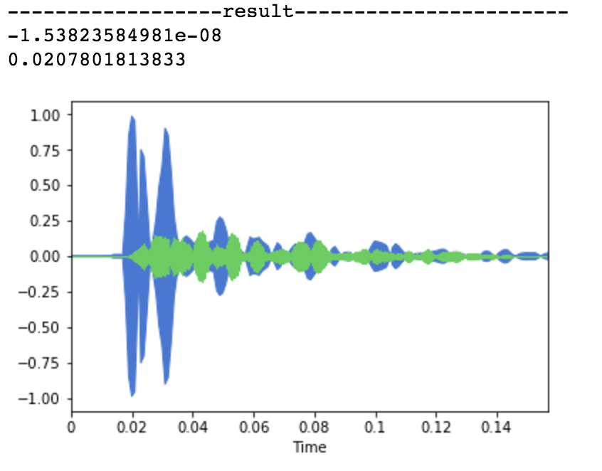

# Collaborative Filtering

추출한 snare소리와 원곡의 비교결과 정확히 일치하는 부분과 유사한 부분 1군데(코사인 유사도가 0에 근접한)를 발견할 수 있었습니다. 하지만 다른 곡과의 비교에서는 0.9(대부분의 데이터가 다름)이상의 값들만 확인되었습니다.

#### issue
1. 다른 악기 요소가 섞이면 코사인 유사도는 굉장히 값이 떨어질 수 있음(비교 길이가 최소 5000 이상이기 때문)
2. 가지고 있는 데이터가 많으면 많아질 수록 비교해야 되는 연산량이 증가하게 됨.

#### known problem
1. 추출한 음악의 앞과뒤에 무음부분이 자동으로 들어가는것으로 보여 제거하고 비교해줘야 한다.
