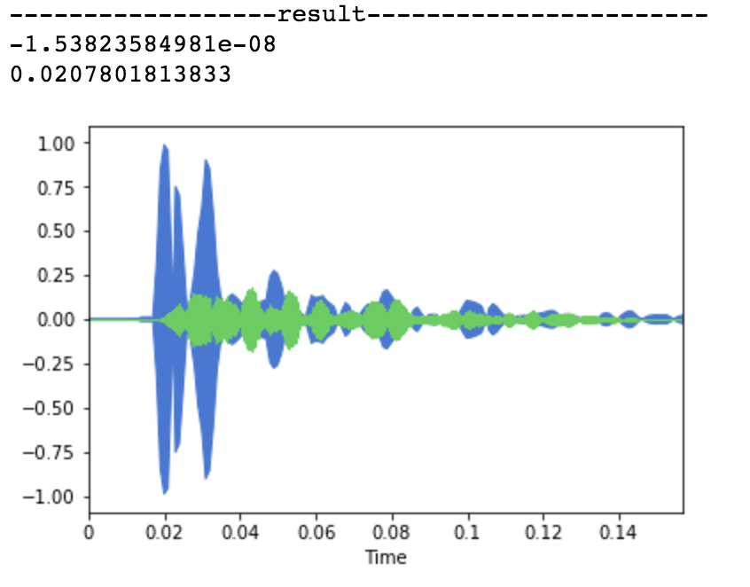
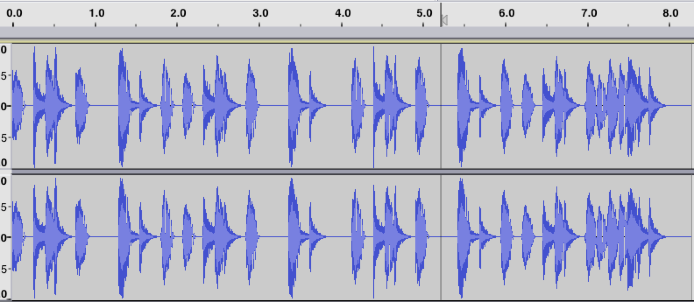

# Collaborative Filtering


## 1. Compare with original song && other song

#### result of compare _(Drum1.mp3 with Drum1_snare.mp3)_


추출한 snare소리와 원곡의 비교에서는 정확히 일치하는 부분과 유사한 부분 1군데(코사인 유사도가 0에 근접한)를 발견할 수 있었습니다. 하지만 다른 곡과의 비교에서는 0.9(대부분의 데이터가 다름)이상의 값들만 확인되었습니다.


#### issue
1. 다른 악기 요소가 섞이면 코사인 유사도는 굉장히 값이 떨어질 수 있음(비교 길이가 최소 5000 이상이기 때문)
2. 가지고 있는 데이터가 많으면 많아질 수록 비교해야 되는 연산량이 증가하게 됨.


#### known problem
1. 추출한 음악의 앞과뒤에 무음부분이 자동으로 들어가는것으로 보여 제거하고 비교해줘야 한다.


## 2. Compare with average data

#### generate average.wav
한가지 악기에 대한 데이터의 파장의 평균값을(compressionMp3.ipynb) 구하여 average.wav 파일을 생성하였습니다.


#### result of compare _(Hip-hop-drum-beat-116-bpm.wav with average.wav)_
- wave of Hip-hop-drum-beat-116-bpm.wav

  

- list of expected time of kick
  ```
  0.0132199546485
  0.401156462585
  0.789070294785
  1.3064399093
  1.8235600907
  2.08219954649
  2.47011337868
  2.85804988662
  3.3753968254
  4.15115646259
  4.53909297052
  4.92700680272
  5.44437641723
  5.96149659864
  6.22011337868
  6.60804988662
  6.99596371882
  7.12526077098
  7.2546031746
  7.38392290249
  7.51342403628
  ```


  #### issue
  1. data set이 증가할수록 average.wav가 더욱 유의미한 데이터를 추출할 수 있는 형태로 만들어 질지 알수 없다.


  #### known problem
  1. 다른 악기가 추가됨에 따라 각 악기간의 상관관계를 표현하는 로직이 필요하다.
